# Release Process Documentation

## Overview

This document describes the complete release process for the `solace-agent-mesh-core-plugins` monorepo. The process is highly automated using release-please, with security gates via FOSSA and SonarQube.

## Table of Contents

- [Quick Start: Release Manager Checklist](#quick-start-release-manager-checklist)
- [Release Process Flow](#release-process-flow)
- [Key Components](#key-components)
- [Gating Mechanisms](#gating-mechanisms)
- [Step-by-Step Release Guide](#step-by-step-release-guide)
- [FOSSA Integration](#fossa-integration)
- [Troubleshooting](#troubleshooting)
- [FAQ](#faq)

## Quick Start: Release Manager Checklist

### Your Role as Release Manager

As the release manager, **you don't build or publish anything manually**. The entire process is automated. Your job is to:
1. Review and validate the release
2. Make go/no-go decisions on security warnings
3. Approve and merge the release PR
4. Monitor the automated publish process

### Action Items: What YOU Need to Do

#### Step 1: Find the Release PR
- [ ] Go to the repository's [Pull Requests](../../pulls) page
- [ ] Look for a PR titled `chore: release main` (created by release-please bot)
- [ ] If no release PR exists, check if recent commits used [conventional commit format](#conventional-commits)

#### Step 2: Review the Release Contents
- [ ] Open the release PR
- [ ] Review the **"Release Readiness Check Results"** comment (auto-posted by bot)
- [ ] Note which plugins are being released (listed in the comment)
- [ ] Click "Files changed" tab and review:
  - [ ] Version bumps in `pyproject.toml` files - do they make sense?
  - [ ] `CHANGELOG.md` entries - are they accurate?
  - [ ] `.release-please-manifest.json` - versions match expectations?

#### Step 3: Check CI Status (MUST PASS)
- [ ] Scroll to bottom of PR page and check the status checks
- [ ] **CI Workflow** - Must be ✅ GREEN
  - If ❌ RED: Click "Details" → identify failure → fix in separate PR to main → release PR auto-updates
- [ ] **Build Plugin** checks - All must be ✅ GREEN
  - If ❌ RED due to FOSSA: Go to [FOSSA dashboard](https://app.fossa.com/) → review violation → fix or request exception

#### Step 4: Review Security Checks (Advisory)
Read the **"Release Readiness Check Results"** comment and assess:

- [ ] **SonarQube Hotspots**
  - ✅ Success: No action needed
  - ⚠️ Warning: Click through to review hotspots → assess risk → document decision

- [ ] **FOSSA Licensing (Project-Level)**
  - ✅ Success: No action needed
  - ⚠️ Warning: Review policy violations → consult security team if needed → document decision

- [ ] **FOSSA Vulnerabilities (Project-Level)**
  - ✅ Success: No action needed
  - ⚠️ Warning: Review CVE details → assess severity vs. urgency → document decision

**Note:** These checks are advisory only - they won't block the merge, but you should review them.

#### Step 5: Make Go/No-Go Decision
- [ ] **Hard Gates (must be green):**
  - CI builds passing
  - Per-plugin FOSSA scans passing
- [ ] **Soft Gates (your judgment):**
  - SonarQube warnings acceptable?
  - Project-level FOSSA warnings acceptable?
  - Release timing appropriate?
- [ ] **Document your decision** in a PR comment if proceeding with warnings

#### Step 6: Approve and Merge
- [ ] Click "Review changes" → "Approve" → "Submit review"
- [ ] Click "Merge pull request"
- [ ] Confirm the merge
- [ ] **DO NOT REBASE** - use "Create a merge commit" or "Squash and merge"

#### Step 7: Monitor Automated Publishing
After merging, the automation takes over. Monitor these:

- [ ] Go to [Actions tab](../../actions)
- [ ] Watch for **"Release Please"** workflow on main branch
  - Should complete in ~1 minute
  - Creates GitHub releases for each changed plugin
- [ ] Watch for **"Publish Package"** workflows (one per plugin)
  - Should complete in ~5 minutes each
  - Publishes to PyPI
- [ ] Check [Releases page](../../releases)
  - [ ] Verify each plugin has a new release
  - [ ] Check release notes look correct
  - [ ] Verify artifacts (wheel + tarball) are attached

#### Step 8: Verify Publication
For each released plugin, verify it's live:

```bash
# Check PyPI (replace with actual plugin name and version)
pip index versions sam-slack

# Test installation
python -m venv test-env
source test-env/bin/activate  # or `test-env\Scripts\activate` on Windows
pip install sam-slack==0.3.0

# Verify
python -c "import sam_slack; print(sam_slack.__version__)"
```

- [ ] All plugins installable from PyPI
- [ ] Versions match release tags
- [ ] No import errors

#### Step 9: Post-Release Communication
- [ ] Post release announcement in relevant Slack channels
- [ ] Update any tracking documents/tickets
- [ ] Notify stakeholders of new versions
- [ ] Update external documentation if needed

### Time Commitment

| Phase | Your Time | Automation Time |
|-------|-----------|-----------------|
| Review release PR | 10-30 minutes | - |
| Approve and merge | 1 minute | - |
| Monitor publishing | 5-10 minutes | 5-10 minutes |
| Verify and communicate | 10-20 minutes | - |
| **Total** | **30-60 minutes** | **5-10 minutes** |

### What You DON'T Need to Do

- ❌ Build packages locally
- ❌ Run tests manually
- ❌ Tag releases in git
- ❌ Create GitHub releases
- ❌ Publish to PyPI
- ❌ Upload artifacts
- ❌ Update version numbers manually
- ❌ Write changelogs

**All of the above are automated!**

### When to Escalate

Contact the security team or repository owners if:
- FOSSA finds critical/high vulnerabilities with no fix available
- SonarQube shows security hotspots you don't understand
- Multiple release attempts fail
- Unusual or unexpected version bumps
- Uncertainty about proceeding with warnings

### Emergency Rollback

If a critical issue is discovered post-release:
1. **Cannot unpublish from PyPI** (only "yank" which hides but doesn't delete)
2. Create hotfix PR with fix
3. Merge to main (triggers new release PR)
4. Fast-track the new release PR
5. Publish patched version
6. Yank broken version on PyPI if critical security issue
7. Notify users via security advisory

## Workflow Diagrams

### Workflow 1: Developer PR Process (Feature Development)

This is the standard workflow for developers working on features/fixes until code reaches `main`.


### Workflow 2: Release Process (Release Manager)

This workflow starts when changes have accumulated on `main` and release-please creates a release PR.

```mermaid
flowchart TD
    Start["Changes Merged to Main<br/>(from Workflow 1)"] --> Monitor[Release-Please Bot<br/>Monitors Main Branch]

    Monitor --> Analyze[Analyzes Conventional Commits<br/>Since Last Release]

    Analyze --> Determine[Determines:<br/>• Which plugins changed<br/>• Version bumps needed]

    Determine --> CreatePR["🤖 Bot Creates/Updates<br/>Release PR: 'chore: release main'"]

    CreatePR --> PRContent["PR Contains:<br/>✓ Version bumps (pyproject.toml)<br/>✓ CHANGELOGs<br/>✓ .release-please-manifest.json<br/>✓ Only changed plugins"]

    PRContent --> Triggers{PR Triggers<br/>2 Workflows}

    %% CI Path (Same as regular PR)
    Triggers --> CI["CI Workflow (Hard Gate)<br/>Same as Workflow 1"]
    CI --> CIBuild[Build & Test<br/>Per-Plugin FOSSA]
    CIBuild --> CIGate{CI Pass?}
    CIGate -->|❌| Block1["❌ BLOCKED<br/>Cannot Merge"]
    CIGate -->|✅| CIPass[✅ CI Passes]

    %% Release Readiness (Unique to Release PR)
    Triggers --> ReadinessCheck["Release Readiness Check<br/>(ADVISORY - Warnings Only)"]
    ReadinessCheck --> Security[Run Security Checks:<br/>• SonarQube Hotspots<br/>• Project-Level FOSSA<br/>• Licensing<br/>• Vulnerabilities]
    Security --> BotComment["🤖 Bot Posts Comment<br/>with Check Results"]

    BotComment --> ReleaseReview["<b>👤 RELEASE MANAGER:</b><br/>Review Release PR"]

    ReleaseReview --> Check1["✓ Review version bumps<br/>✓ Review CHANGELOGs<br/>✓ Check CI status (must pass)<br/>✓ Review security warnings"]

    Check1 --> Decision{Go/No-Go<br/>Decision}

    CIPass --> Decision

    Decision -->|No-Go| NoMerge["Document Concerns<br/>or Fix Issues First"]
    Decision -->|Go| ApproveAndMerge["<b>👤 RELEASE MANAGER:</b><br/>Approve & Merge PR"]

    ApproveAndMerge --> MainMerge[PR Merged to Main]

    MainMerge --> ReleaseAction["🤖 Release-Please Action<br/>Runs on Main"]

    ReleaseAction --> CreateReleases["🤖 Creates GitHub Releases<br/>One per Changed Plugin"]

    CreateReleases --> Tags["Example Tags:<br/>vsam-slack-v0.3.0<br/>vsam-rag-v0.2.0"]

    Tags --> PublishTrigger["Each Release Triggers<br/>publish.yaml"]

    PublishTrigger --> ParallelPublish{Publishing<br/>In Parallel}

    ParallelPublish --> P1["Plugin 1:<br/>sam-slack"]
    ParallelPublish --> P2["Plugin 2:<br/>sam-rag"]

    P1 --> Build1[Extract Path → Build → Publish]
    P2 --> Build2[Extract Path → Build → Publish]

    Build1 --> PyPI1[📦 Published to PyPI<br/>+ GitHub Release Artifacts]
    Build2 --> PyPI2[📦 Published to PyPI<br/>+ GitHub Release Artifacts]

    PyPI1 --> Monitor1["<b>👤 RELEASE MANAGER:</b><br/>Monitor Actions Tab"]
    PyPI2 --> Monitor1

    Monitor1 --> Verify["<b>👤 RELEASE MANAGER:</b><br/>Verify Publication"]

    Verify --> Test["Test:<br/>pip install sam-slack==0.3.0<br/>pip install sam-rag==0.2.0"]

    Test --> Communicate["<b>👤 RELEASE MANAGER:</b><br/>Post-Release Communication"]

    Communicate --> Done[✅ Release Complete]

    %% Styling
    classDef rmClass fill:#ffd43b,stroke:#f08c00,stroke-width:3px,color:#000
    classDef gateClass fill:#ff6b6b,stroke:#c92a2a,stroke-width:3px,color:#fff
    classDef passClass fill:#51cf66,stroke:#2f9e44,stroke-width:2px
    classDef autoClass fill:#4dabf7,stroke:#1971c2,stroke-width:2px

    class ReleaseReview,Check1,ApproveAndMerge,Monitor1,Verify,Test,Communicate rmClass
    class Block1,CIGate,NoMerge gateClass
    class CIPass,Done passClass
    class Monitor,Analyze,Determine,CreatePR,CI,CIBuild,ReadinessCheck,Security,BotComment,ReleaseAction,CreateReleases,PublishTrigger,Build1,Build2,PyPI1,PyPI2 autoClass
```



### Legend

| Icon/Color | Meaning |
|------------|---------|
| 👨‍💻 **Purple** | Developer actions (Workflow 1) |
| 👤 **Yellow** | Release Manager actions (Workflow 2) |
| 🤖 **Blue** | Automated processes |
| 🔴 **Red** | Hard gate - blocks merge |
| 🟢 **Green** | Success/completion |

## Key Components

### 1. Release-Please Configuration

The monorepo uses [release-please v4](https://github.com/googleapis/release-please) for automated versioning and changelog generation.

**Configuration Files:**
- [`release-please-config.json`](release-please-config.json) - Release behavior configuration
- [`.release-please-manifest.json`](.release-please-manifest.json) - Current version tracking per plugin
- [`.github/workflows/release-please.yaml`](.github/workflows/release-please.yaml) - Automation workflow

**Key Settings:**
- `separate-pull-requests: false` - Single unified PR for all releases
- `include-component-in-tag: true` - Tags include component name (e.g., `vsam-slack-v0.3.0`)
- `include-v-in-tag: true` - Tags include 'v' prefix
- `bump-minor-pre-major: true` - Pre-1.0.0, `feat:` commits bump minor version
- `bump-patch-for-minor-pre-major: true` - Pre-1.0.0, `fix:` commits bump patch version

### 2. Conventional Commits

Release-please analyzes conventional commits to determine version bumps:

| Commit Type | Version Bump | Example |
|-------------|--------------|---------|
| `feat(plugin):` | Minor (0.1.0 → 0.2.0) | `feat(sam-slack): add emoji support` |
| `fix(plugin):` | Patch (0.1.0 → 0.1.1) | `fix(sam-slack): resolve connection timeout` |
| `feat!(plugin):` or `BREAKING CHANGE:` | Major (0.1.0 → 1.0.0) | `feat(sam-slack)!: change API interface` |
| `docs:`, `chore:`, `test:` | No release | `chore(sam-slack): update dependencies` |

**Important:** The scope (e.g., `sam-slack`) determines which plugin gets released.

### 3. Workflows

#### CI Workflow ([`.github/workflows/ci.yaml`](.github/workflows/ci.yaml))
- **Trigger:** All PRs (except `.github` changes)
- **Purpose:** Build and test changed plugins
- **Gating:** Hard gate - must pass to merge

#### Release Readiness Check ([`.github/workflows/release-readiness-check.yaml`](.github/workflows/release-readiness-check.yaml))
- **Trigger:** All PRs to main
- **Detection:** Only runs security checks if PR title matches `chore: release`
- **Purpose:** Validate security compliance before release
- **Gating:** Soft gate - warnings only, doesn't block merge

#### Build Plugin ([`.github/workflows/build-plugin.yaml`](.github/workflows/build-plugin.yaml))
- **Trigger:** Called by CI workflow
- **Purpose:** Build, test, and scan individual plugins
- **Gating:** Hard gate - FOSSA blocks on license/vulnerability issues

#### Publish ([`.github/workflows/publish.yaml`](.github/workflows/publish.yaml))
- **Trigger:** GitHub release published
- **Purpose:** Build and publish to PyPI
- **Gating:** No gates - releases are already approved

## Gating Mechanisms

### Hard Gates (Block Merge)

These checks **must pass** for a release PR to be mergeable:

#### 1. FOSSA License Compliance (Per-Plugin)
- **Location:** [`build-plugin.yaml:88-99`](.github/workflows/build-plugin.yaml#L88-L99)
- **Mode:** BLOCK
- **Trigger:** `policy_conflict`
- **Scope:** Per-plugin (e.g., `SolaceLabs_sam-slack`)
- **Config:** Plugin-specific `.fossa.yml` files

```yaml
- name: FOSSA Licensing
  uses: SolaceDev/solace-public-workflows/.github/actions/fossa-guard@main
  with:
    fossa_mode: BLOCK
    block_on: policy_conflict
```

#### 2. FOSSA Vulnerability Scan (Per-Plugin)
- **Location:** [`build-plugin.yaml:101-113`](.github/workflows/build-plugin.yaml#L101-L113)
- **Mode:** BLOCK
- **Trigger:** `critical`, `high` severity vulnerabilities
- **Scope:** Per-plugin
- **Config:** Plugin-specific `.fossa.yml` files

```yaml
- name: FOSSA Security Vulnerabilities
  uses: SolaceDev/solace-public-workflows/.github/actions/fossa-guard@main
  with:
    fossa_mode: BLOCK
    block_on: critical,high
```

#### 3. Build and Test Failures
- Any build, test, or packaging validation failure blocks merge

### Soft Gates (Warning Only)

These checks run but **do not block** merge:

#### 1. SonarQube Hotspot Check (Project-Level)
- **Location:** [`release-readiness-check.yaml:80-86`](.github/workflows/release-readiness-check.yaml#L80-L86)
- **Mode:** Warning (`continue-on-error: true`)
- **Scope:** Entire repository
- **Output:** Posted as PR comment

#### 2. FOSSA License Check (Project-Level)
- **Location:** [`release-readiness-check.yaml:88-99`](.github/workflows/release-readiness-check.yaml#L88-L99)
- **Mode:** Warning (`continue-on-error: true`)
- **Scope:** Repository project `SolaceLabs_solace-agent-mesh-core-plugins`
- **Output:** Posted as PR comment

#### 3. FOSSA Vulnerability Check (Project-Level)
- **Location:** [`release-readiness-check.yaml:101-112`](.github/workflows/release-readiness-check.yaml#L101-L112)
- **Mode:** Warning (`continue-on-error: true`)
- **Scope:** Repository project
- **Output:** Posted as PR comment

## Step-by-Step Release Guide

### For Release Managers

#### Phase 1: Wait for Release PR

1. **Automatic Creation:**
   - Release-please bot monitors the `main` branch
   - Detects conventional commits since last release
   - Creates or updates a PR titled `chore: release main`

2. **PR Contents:**
   - Version bumps in affected `pyproject.toml` files
   - Updated `CHANGELOG.md` in affected plugins
   - Updated `.release-please-manifest.json`

#### Phase 2: Review Release PR

1. **Identify Plugins Being Released:**
   - Check the "Release Readiness Check Results" comment
   - Look for "Plugins being released:" section
   - Review changed files to confirm scope

2. **Verify Version Bumps:**
   - Ensure version increments are appropriate
   - Check if conventional commit types match version changes
   - Example: `feat:` should bump minor, `fix:` should bump patch

3. **Review Changelogs:**
   - Navigate to each plugin's `CHANGELOG.md`
   - Verify entries match the actual changes
   - Check for any missing or incorrect entries

4. **Check CI Status:**
   - ✅ All CI checks must be green (hard gate)
   - If failed:
     - Click into failed workflow
     - Identify the issue (build, test, FOSSA)
     - Fix the issue in the codebase
     - Push to `main` branch
     - Release PR updates automatically

5. **Review Security Checks:**
   - Read the "Release Readiness Check Results" comment
   - **SonarQube Hotspots:**
     - ✅ Success - No unresolved hotspots
     - ⚠️ Warning - Review hotspots, use judgment
   - **FOSSA Licensing:**
     - ✅ Success - All licenses compliant
     - ⚠️ Warning - Review policy violations, use judgment
   - **FOSSA Vulnerabilities:**
     - ✅ Success - No critical/high CVEs
     - ⚠️ Warning - Review CVEs, assess risk

6. **Make Go/No-Go Decision:**
   - Hard gates must pass (CI, per-plugin FOSSA)
   - Soft gates are advisory (project-level checks)
   - Consider risk vs. urgency
   - Consult security team if needed

#### Phase 3: Merge Release PR

1. **Approve PR:**
   - Add approval if required by branch protection
   - Ensure at least one approval from release manager

2. **Merge:**
   - Click "Merge pull request"
   - Use "Squash and merge" or "Create a merge commit" (avoid rebase)
   - Confirm merge

3. **Automatic Post-Merge Actions:**
   - Release-please workflow runs on `main`
   - Creates GitHub releases for each changed plugin
   - Tags format: `v{plugin-name}-v{version}` (e.g., `vsam-slack-v0.3.0`)

#### Phase 4: Monitor Publishing

1. **Watch GitHub Actions:**
   - Navigate to Actions tab
   - Look for "Publish Package" workflows
   - One workflow per plugin being released
   - Runs in parallel for multiple plugins

2. **Verify GitHub Releases:**
   - Check Releases page
   - Each plugin has separate release
   - Release notes include changelog
   - Artifacts (wheel + tarball) attached

3. **Verify PyPI Publication:**
   - Check [PyPI](https://pypi.org/search/?q=sam_) for each plugin
   - Confirm new version is live
   - Test installation: `pip install {package-name}=={version}`

4. **Handle Failures:**
   - If PyPI publish fails:
     - Check workflow logs for error
     - Common issues: version conflict, network timeout
     - Can manually re-run workflow from Actions tab
   - If build fails:
     - Check for environment issues
     - Verify pyproject.toml is valid
     - May need to create hotfix

#### Phase 5: Post-Release Validation

1. **Test Installation:**
   ```bash
   # Create fresh virtual environment
   python -m venv test-env
   source test-env/bin/activate

   # Install released version
   pip install sam-slack==0.3.0

   # Verify installation
   python -c "import sam_slack; print(sam_slack.__version__)"
   ```

2. **Verify Documentation:**
   - Check that CHANGELOG.md is accurate
   - Ensure release notes on GitHub are complete
   - Update any external documentation if needed

3. **Communicate Release:**
   - Notify stakeholders of new versions
   - Post in relevant Slack channels
   - Update project tracking tools

## FOSSA Integration

### Two-Layer Scanning Strategy

#### Layer 1: Per-Plugin Scanning (Hard Gate)

**Purpose:** Ensure each plugin independently meets compliance requirements

**When:** On every CI build (all PRs including release PRs)

**Configuration:**
- Each plugin has its own `.fossa.yml` file
- Example: `sam-bedrock-agent/.fossa.yml`
- Separate FOSSA project per plugin (e.g., `SolaceLabs_sam-bedrock-agent`)

**Behavior:**
- BLOCKS merge on:
  - License policy violations
  - Critical or high severity vulnerabilities
- Runs during `build-plugin.yaml` workflow
- Must pass for PR to be mergeable

**FOSSA Projects:**
```
SolaceLabs_sam-bedrock-agent
SolaceLabs_sam-event-mesh-agent
SolaceLabs_sam-event-mesh-gateway
... (one per plugin)
```

#### Layer 2: Project-Level Scanning (Soft Gate)

**Purpose:** Provide holistic view of repository compliance

**When:** On release-please PRs only

**Configuration:**
- Root `.fossa.yml` file
- Single FOSSA project: `SolaceLabs_solace-agent-mesh-core-plugins`

**Behavior:**
- WARNS but does NOT block merge
- Runs during `release-readiness-check.yaml` workflow
- Posted as comment on release PR
- Release manager uses judgment

**Why Two Layers?**

1. **Per-plugin ensures each package is independently compliant**
   - Published packages must meet standards
   - Users can trust individual packages

2. **Project-level provides aggregate view**
   - See overall security posture
   - Identify cross-cutting issues
   - Make informed risk decisions

### FOSSA Configuration Details

#### Root Configuration ([`.fossa.yml`](.fossa.yml))
```yaml
project:
  locator: SolaceLabs_solace-agent-mesh-core-plugins
  id: SolaceLabs_solace-agent-mesh-core-plugins
  name: solace-agent-mesh-core-plugins
  labels:
    - solaceai
    - repository
    - solace-agent-mesh-core-plugins

paths:
  exclude:
    - ./.github
```

#### Plugin Configuration (e.g., [`sam-bedrock-agent/.fossa.yml`](sam-bedrock-agent/.fossa.yml))
```yaml
project:
  locator: SolaceLabs_sam-bedrock-agent
  id: SolaceLabs_sam-bedrock-agent
  name: sam-bedrock-agent
  labels:
    - solaceai
    - solace-agent-mesh-core-plugins
```

## Troubleshooting

### Common Issues

#### 1. Release PR Not Created

**Symptoms:**
- Code merged to main but no release PR appears

**Possible Causes:**
- Commits don't follow conventional commit format
- Commits missing scope (e.g., `feat: add feature` instead of `feat(sam-slack): add feature`)
- Only changed hidden sections (e.g., `chore:`, `test:`)

**Solution:**
```bash
# Check recent commits
git log --oneline main -10

# Ensure commits follow format:
# <type>(<scope>): <description>
# Example: feat(sam-slack): add emoji support
```

#### 2. CI Fails on Release PR

**Symptoms:**
- Red X on CI workflow
- PR cannot be merged

**Possible Causes:**
- FOSSA license violation
- FOSSA vulnerability (critical/high)
- Build/test failure
- Twine validation failure

**Solution:**
1. Click into failed workflow
2. Identify specific step that failed
3. If FOSSA issue:
   - View FOSSA dashboard for details
   - Update dependencies to resolve
   - Or request policy exception
4. If build/test issue:
   - Fix code in separate PR to main
   - Release PR updates automatically
5. If Twine issue:
   - Check package metadata
   - Verify pyproject.toml syntax

#### 3. FOSSA Hard Gate Blocks Merge

**Symptoms:**
- CI fails at FOSSA licensing or vulnerability step
- Error message indicates BLOCK mode triggered

**Solution:**

**For License Violations:**
```bash
# View FOSSA dashboard
# URL in workflow logs

# Options:
# 1. Update dependency to compliant version
# 2. Remove non-compliant dependency
# 3. Request policy exception from security team
```

**For Vulnerabilities:**
```bash
# View vulnerability details in FOSSA

# Options:
# 1. Update to patched version
# 2. If no patch available:
#    - Assess risk vs. functionality
#    - Request security team review
#    - Consider temporary exception
# 3. Remove vulnerable dependency
```

#### 4. Release Readiness Shows Warnings

**Symptoms:**
- Release Readiness Check comment shows ⚠️ warnings
- PR is still mergeable (soft gate)

**Solution:**
1. Review warning details in comment
2. Click through to SonarQube/FOSSA for details
3. Assess risk:
   - Low risk: Document decision and proceed
   - Medium risk: Consult security team
   - High risk: Consider fixing before release
4. Document decision in PR comment
5. Proceed with merge if appropriate

#### 5. PyPI Publish Fails

**Symptoms:**
- GitHub release created successfully
- Publish workflow fails
- Package not on PyPI

**Possible Causes:**
- Version already exists on PyPI
- Network timeout
- PyPI API issues
- Trusted publisher misconfiguration

**Solution:**

**For Version Conflict:**
```bash
# Cannot re-publish same version to PyPI
# Options:
# 1. If accidental release, create patch version
# 2. If serious issue, yank version on PyPI
```

**For Trusted Publisher Issues:**
```bash
# Verify configuration:
# 1. Check PyPI project settings
# 2. Ensure GitHub Actions environment matches
# 3. Verify workflow permissions
```

**To Retry:**
1. Go to Actions tab
2. Find failed "Publish Package" workflow
3. Click "Re-run failed jobs"
4. Monitor for success

#### 6. Wrong Version Released

**Symptoms:**
- Expected minor bump, got patch bump (or vice versa)

**Cause:**
- Incorrect conventional commit type

**Prevention:**
```bash
# Ensure commits use correct type:
feat(sam-slack):     # Minor bump (0.1.0 → 0.2.0)
fix(sam-slack):      # Patch bump (0.1.0 → 0.1.1)
feat(sam-slack)!:    # Major bump (0.1.0 → 1.0.0)
chore(sam-slack):    # No release
```

**Recovery:**
- Cannot undo PyPI release
- Create follow-up release with correct version
- Update documentation to note version skip

#### 7. Multiple Plugins Released Unintentionally

**Symptoms:**
- Expected single plugin release
- Multiple plugins in release PR

**Cause:**
- Commits modified multiple plugin directories
- Cross-cutting changes (e.g., shared dependencies)

**Prevention:**
- Keep changes isolated to single plugin
- Use separate PRs for changes to different plugins
- If cross-cutting change needed, coordinate release

**Recovery:**
- If unintended, all releases are already published
- Cannot undo without yanking versions
- Consider if harm done or acceptable
- Document in release notes

## FAQ

### Q: Do all 16 plugins get released every time?

**A:** No. Release-please is smart and only releases plugins with changes since their last release. It analyzes conventional commits and determines which plugin directories were modified.

Example:
```bash
# Only changed sam-slack
git commit -m "feat(sam-slack): add emoji support"

# Result: Only sam-slack gets version bump and release
# Other 15 plugins remain at their current versions
```

### Q: Can I manually trigger a release for a specific plugin?

**A:** Not directly. Release-please is commit-driven. To trigger a release:

1. Make a change to the plugin (even documentation)
2. Commit with conventional commit format
3. Push to main
4. Release-please updates release PR

Alternatively, you can create a GitHub release manually, but this bypasses the automated process and is not recommended.

### Q: What if I need to release multiple plugins at once?

**A:** Release-please handles this automatically. If your commits touch multiple plugins, all will be included in the release PR:

```bash
# Changes both sam-slack and sam-rag
git commit -m "feat(sam-slack): add emoji support"
git commit -m "feat(sam-rag): improve embeddings"

# Result: Single release PR with both plugins
# When merged, creates 2 separate GitHub releases
```

### Q: Can I skip FOSSA checks for urgent releases?

**A:** Hard gates (per-plugin FOSSA) cannot be skipped without modifying workflows. Soft gates (project-level) already don't block.

For emergencies:
1. Temporarily disable FOSSA steps in workflow
2. Merge and release
3. Re-enable FOSSA steps
4. Create follow-up release with fixes

**Not recommended** - only for critical production issues.

### Q: How do I know which version of a plugin is in production?

**A:** Check:
1. `.release-please-manifest.json` for latest released version
2. GitHub Releases page for release history
3. PyPI for published versions
4. Your production deployment configuration

### Q: What happens if I merge a release PR accidentally?

**A:** The release process is irreversible:
1. GitHub releases are created immediately
2. PyPI packages are published automatically
3. You cannot unpublish from PyPI (only "yank")

Prevention:
- Require PR approvals via branch protection
- Use CODEOWNERS to restrict release PR merges
- Add manual approval gate in publish workflow

Recovery:
- If serious issue, yank version on PyPI
- Create hotfix release immediately
- Communicate issue to users

### Q: Can I customize the changelog format?

**A:** Yes, edit `release-please-config.json`:

```json
{
  "changelog-sections": [
    { "type": "feat", "section": "Features" },
    { "type": "fix", "section": "Bug Fixes" },
    { "type": "custom", "section": "Custom Section" }
  ]
}
```

Sections with `"hidden": true` won't appear in CHANGELOG.

### Q: How do I create a major version release (1.0.0)?

**A:** Use breaking change notation:

```bash
# Option 1: Exclamation mark
git commit -m "feat(sam-slack)!: redesign API"

# Option 2: Footer
git commit -m "feat(sam-slack): redesign API

BREAKING CHANGE: API interface completely redesigned"
```

Release-please will bump to next major version.

### Q: Can I test the release process before merging?

**A:** Partially:
1. CI runs on release PR - shows if builds work
2. Release Readiness Check runs - shows security status
3. Cannot test PyPI publish without actual release

For full testing:
- Use a test PyPI instance
- Fork repository and test there
- Or rely on CI validation

### Q: What if FOSSA finds a vulnerability after release?

**A:** Post-release vulnerability handling:
1. FOSSA scans continue on main branch
2. If found, create fix PR
3. Release-please creates new patch release
4. Yank vulnerable version on PyPI if critical
5. Notify users via security advisory

### Q: How long does the release process take?

**A:** Timeline:
- Release PR creation: Immediate after push to main
- CI validation: 5-15 minutes per plugin
- Release Readiness Check: 5-10 minutes
- Merge to release: Manual (seconds to days depending on review)
- PyPI publish: 2-5 minutes per plugin

Total: ~15 minutes automated + manual review time

### Q: Can I release from a branch other than main?

**A:** The current configuration only releases from `main`:

```yaml
# .github/workflows/release-please.yaml
on:
  push:
    branches:
      - main
```

To support other branches, modify the workflow configuration.

### Q: What permissions are needed to manage releases?

**A:** Required permissions:
- **Merge Release PR:** Write access to repository + branch protection approval
- **Manual workflow trigger:** Write access to Actions
- **PyPI publish:** Configured via Trusted Publisher (no manual tokens)
- **FOSSA access:** View-only for reviewing issues

### Q: How do I view FOSSA scan results?

**A:** Access FOSSA dashboards:
1. Click FOSSA action in workflow logs
2. URL provided in step output
3. Or navigate directly to FOSSA portal
4. Projects:
   - Per-plugin: `SolaceLabs_sam-{plugin-name}`
   - Repository: `SolaceLabs_solace-agent-mesh-core-plugins`

## Additional Resources

- [Release Please Documentation](https://github.com/googleapis/release-please)
- [Conventional Commits Specification](https://www.conventionalcommits.org/)
- [FOSSA Documentation](https://docs.fossa.com/)
- [PyPI Trusted Publishers](https://docs.pypi.org/trusted-publishers/)
- [Hatch Documentation](https://hatch.pypa.io/)

## Maintenance

This document should be updated when:
- Workflow configurations change
- New security gates are added
- Release process is modified
- New plugins are added to monorepo
- FOSSA policies are updated

**Last Updated:** 2026-01-15
**Maintained By:** Release Engineering Team
