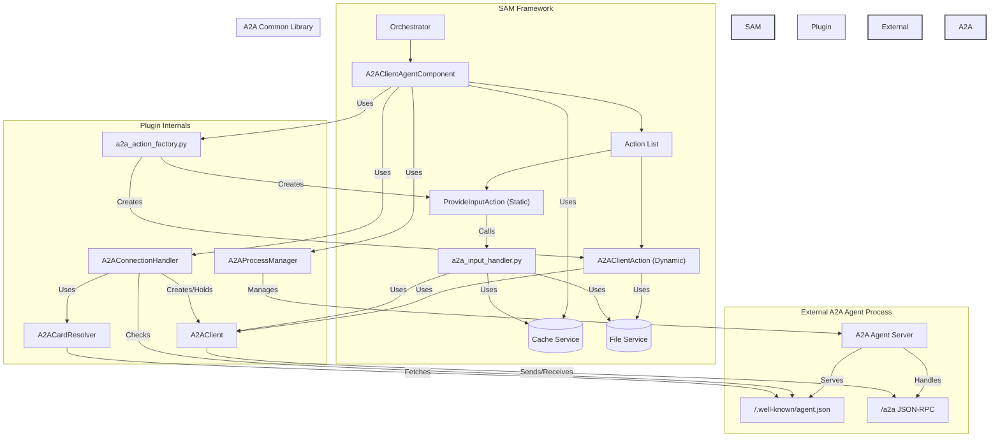
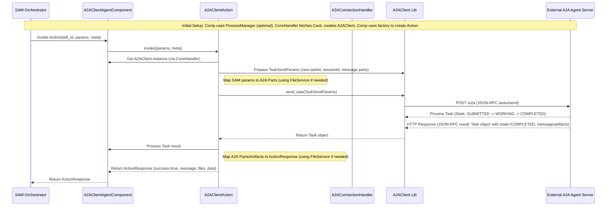
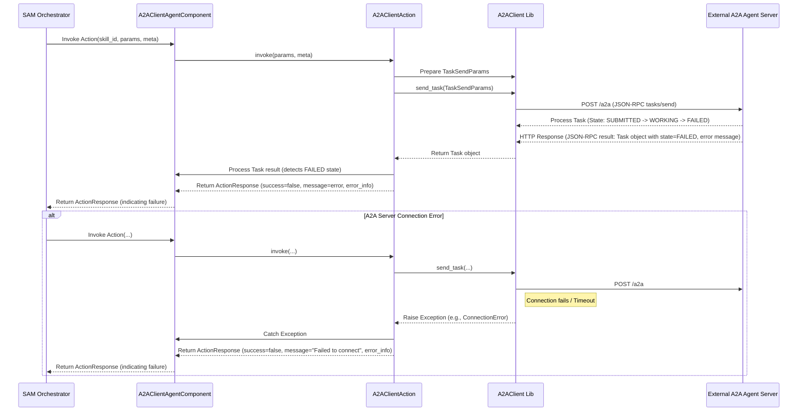
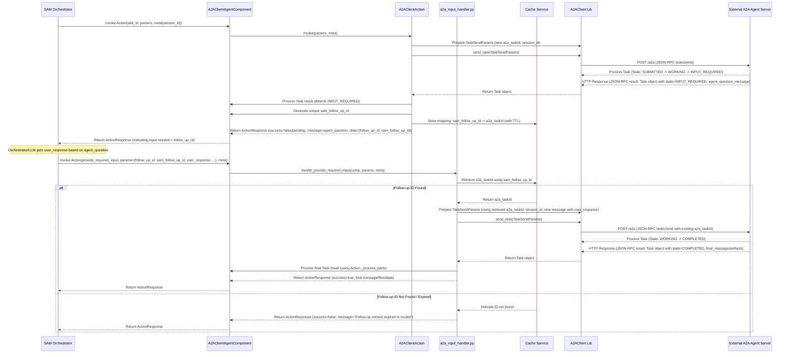

# SAM A2A Client Plugin Architecture

## High-Level Architecture Overview

The `sam-a2a-client` plugin allows Solace Agent Mesh (SAM) to interact with external agents that conform to the Agent-to-Agent (A2A) protocol. It acts as a bridge, enabling SAM to leverage the capabilities of A2A agents.

The core of the plugin is a SAM `BaseAgentComponent` (`A2AClientAgentComponent`). This component orchestrates the interaction with the external A2A agent, delegating specific responsibilities to helper classes and modules:

1.  **Process Management (Optional):** If configured with a command (`a2a_server_command`), the `A2AProcessManager` helper class is used to launch, monitor, and manage the lifecycle of the external A2A agent process, including restarts on failure.
2.  **Connection & Readiness:** The `A2AConnectionHandler` helper class manages the connection to the A2A agent (launched or pre-existing). It checks for agent readiness by polling the `/.well-known/agent.json` endpoint and handles fetching the `AgentCard` using the `A2ACardResolver` library.
3.  **Client Initialization:** `A2AConnectionHandler` initializes the `A2AClient` library instance, configuring it with the agent's URL and any required authentication details (e.g., bearer token) derived from the component's configuration and the fetched `AgentCard`.
4.  **Capability Mapping:** The `a2a_action_factory` module is used by `A2AClientAgentComponent` to parse the `skills` listed in the `AgentCard` and dynamically create corresponding SAM `Action` instances (`A2AClientAction`). Each SAM action maps directly to an A2A skill.
5.  **Invocation Handling:** When the SAM orchestrator invokes one of these dynamic actions, the `A2AClientAction` instance translates the SAM action parameters into an A2A `Task` request.
6.  **A2A Communication:** `A2AClientAction` uses the `A2AClient` instance (held by `A2AConnectionHandler` and accessed via `A2AClientAgentComponent`) to send the `Task` request (via `tasks/send`) to the external A2A agent.
7.  **Response Handling:** `A2AClientAction` receives the A2A `Task` response, processes the result (including handling different `Parts` like text, files, data, and artifacts using the `FileService`), and translates it back into a SAM `ActionResponse`.
8.  **State Management (`INPUT_REQUIRED`):**
    *   If an A2A task returns `INPUT_REQUIRED`, `A2AClientAction` uses the `CacheService` to store the A2A `taskId` mapped to a unique `sam_follow_up_id` and returns this ID to the orchestrator.
    *   A static action, `ProvideInputAction` (created by `a2a_action_factory`), is defined to handle follow-up requests.
    *   When invoked, `ProvideInputAction` calls the `handle_provide_required_input` function (in `a2a_input_handler.py`), which retrieves the original `a2a_taskId` from the cache, constructs a new A2A request with the user's input, sends it via the `A2AClient`, and processes the final response.

This architecture allows the SAM orchestrator and LLM to interact with A2A agents as if they were native SAM agents, abstracting the underlying A2A protocol details and separating concerns like process management and connection handling.

## Component List

*   **`A2AClientAgentComponent`**: The main SAM component derived from `BaseAgentComponent`. Orchestrates the plugin's functionality, holds references to helper classes and core services, manages the `ActionList`, and defines the handler entry point for the static `provide_required_input` action.
*   **`A2AProcessManager`**: Helper class responsible for launching, monitoring, and stopping the external A2A agent process when `a2a_server_command` is configured.
*   **`A2AConnectionHandler`**: Helper class responsible for checking agent readiness, fetching the `AgentCard` (using `A2ACardResolver`), and initializing/holding the `A2AClient` instance.
*   **`a2a_action_factory` (Module)**: Contains factory functions (`create_actions_from_card`, `create_provide_input_action`, `infer_params_from_skill`) used by `A2AClientAgentComponent` to dynamically generate SAM `Action` instances based on the `AgentCard`. Also defines the `ProvideInputAction` class.
*   **`A2AClientAction`**: A dynamically created SAM `Action` class representing a specific A2A `skill`. Handles the invocation logic, parameter mapping, A2A communication (via `A2AClient`), and response processing (including `INPUT_REQUIRED` state initiation).
*   **`ProvideInputAction`**: A static SAM `Action` class created by the factory. Its `invoke` method calls the main handler function for follow-up input.
*   **`a2a_input_handler` (Module)**: Contains the `handle_provide_required_input` function, which implements the logic for retrieving state from the cache and sending follow-up requests to the A2A agent.
*   **`A2AClient` (External Library)**: From the `google/A2A` common library. Used to handle the actual HTTP/JSON-RPC communication with the A2A agent server.
*   **`A2ACardResolver` (External Library)**: From the `google/A2A` common library. Used to fetch and parse the `AgentCard`.
*   **`FileService` (SAM Core)**: Used by `A2AClientAction` and `handle_provide_required_input` to resolve file URLs into bytes for outgoing requests and to save incoming file parts/artifacts for the `ActionResponse`.
*   **Cache Service (SAM Core)**: Used by `A2AClientAction` and `handle_provide_required_input` to store and retrieve the mapping between `sam_follow_up_id` and A2A `taskId` for the `INPUT_REQUIRED` state.

## Component Diagram

## Sequence Diagram - Happy Path (Synchronous `tasks/send`)

## Sequence Diagram - Error Path (e.g., A2A Task Fails)

## Sequence Diagram - Input Required Path

