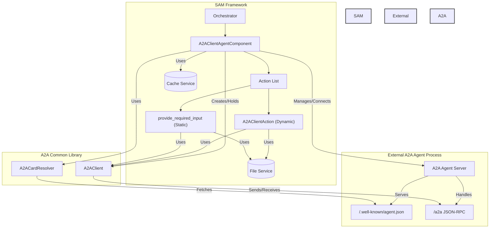
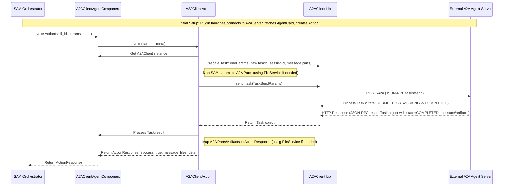
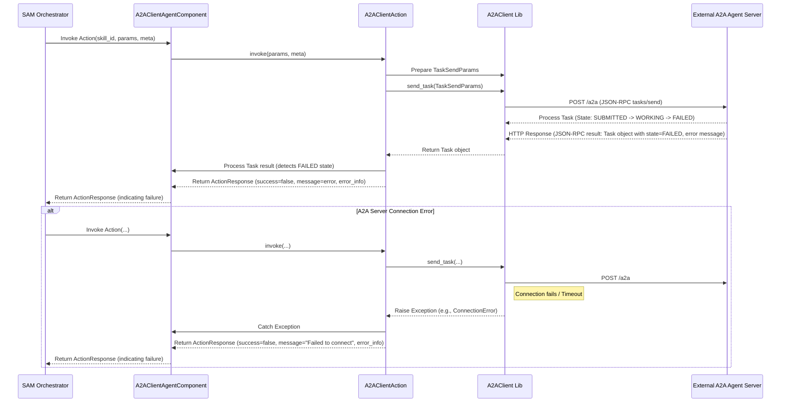
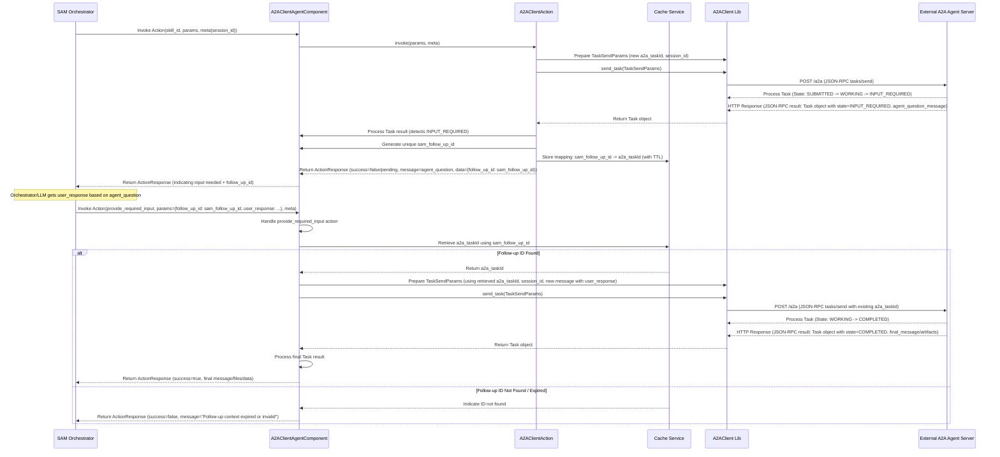

# SAM A2A Client Plugin Architecture

## High-Level Architecture Overview

The `sam-a2a-client` plugin allows Solace Agent Mesh (SAM) to interact with external agents that conform to the Agent-to-Agent (A2A) protocol. It acts as a bridge, enabling SAM to leverage the capabilities of A2A agents.

The core of the plugin is a SAM `BaseAgentComponent` (`A2AClientAgentComponent`). This component performs the following key functions:

1.  **Process Management (Optional):** It can launch and manage the lifecycle of an external A2A agent process based on a configured command (`A2A_SERVER_COMMAND`). It monitors this process and can attempt restarts upon failure.
2.  **Connection:** Alternatively, it can connect to a pre-existing, externally managed A2A agent via a configured URL (`A2A_SERVER_URL`).
3.  **Discovery:** Upon connection (or successful launch), it fetches the target A2A agent's `AgentCard` from its `/.well-known/agent.json` endpoint.
4.  **Capability Mapping:** It parses the `skills` listed in the `AgentCard` and dynamically creates corresponding SAM `Action` instances (`A2AClientAction`). Each SAM action maps directly to an A2A skill, using the `skill.id` as the action name.
5.  **Invocation Handling:** When the SAM orchestrator invokes one of these dynamic actions, the `A2AClientAction` translates the SAM action parameters into an A2A `Task` request.
6.  **A2A Communication:** It uses the `A2AClient` library (from the A2A reference implementation) to send the `Task` request (via `tasks/send`) to the external A2A agent.
7.  **Response Handling:** It receives the A2A `Task` response, processes the result (including handling different `Parts` like text, files, data, and artifacts), and translates it back into a SAM `ActionResponse`.
8.  **State Management (`INPUT_REQUIRED`):** It handles the A2A `INPUT_REQUIRED` state by storing the A2A `taskId`, returning a specific response to SAM with a follow-up ID, and providing a dedicated action (`provide_required_input`) for SAM to submit the required information back to the correct A2A task.

This allows the SAM orchestrator and LLM to interact with A2A agents as if they were native SAM agents, abstracting the underlying A2A protocol details.

## Component List

*   **`A2AClientAgentComponent`**: The main SAM component derived from `BaseAgentComponent`. Manages the connection/process, discovers skills, and holds the `A2AClient` instance. It also defines the static `provide_required_input` action.
*   **`A2AClientAction`**: A dynamically created SAM `Action` class. An instance is created for each discovered A2A `skill`. It handles the invocation logic for a specific skill, translating SAM requests to A2A tasks and A2A responses back to SAM `ActionResponse`.
*   **`A2AClient` (External Library)**: From the `google/A2A` common library. Used to handle the actual HTTP/JSON-RPC communication with the A2A agent server.
*   **`A2ACardResolver` (External Library)**: From the `google/A2A` common library. Used to fetch and parse the `AgentCard`.
*   **`FileService` (SAM Core)**: Used to resolve file URLs provided in SAM action parameters into bytes for A2A `FilePart` and to save incoming A2A `FilePart` or `Artifacts` as files accessible via URL in the `ActionResponse`.
*   **Cache Service (SAM Core)**: Used to store the mapping between `sam_follow_up_id` and A2A `taskId` when handling the `INPUT_REQUIRED` state, potentially with a TTL.

## Component Diagram

## Sequence Diagram - Happy Path (Synchronous `tasks/send`)

## Sequence Diagram - Error Path (e.g., A2A Task Fails)

## Sequence Diagram - Input Required Path

