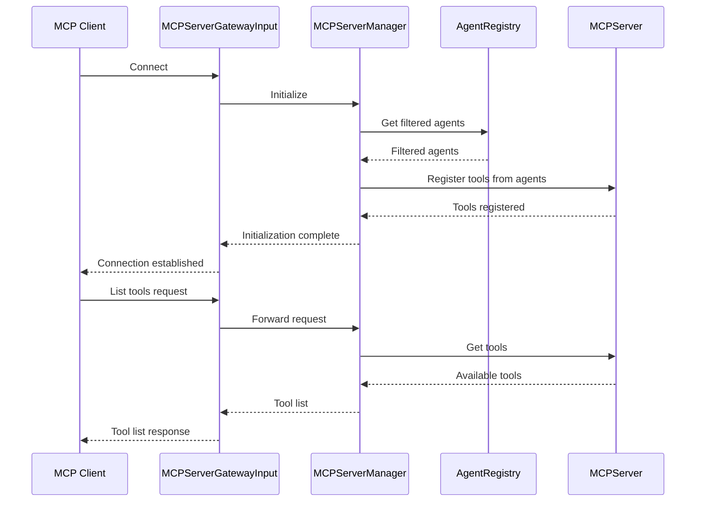
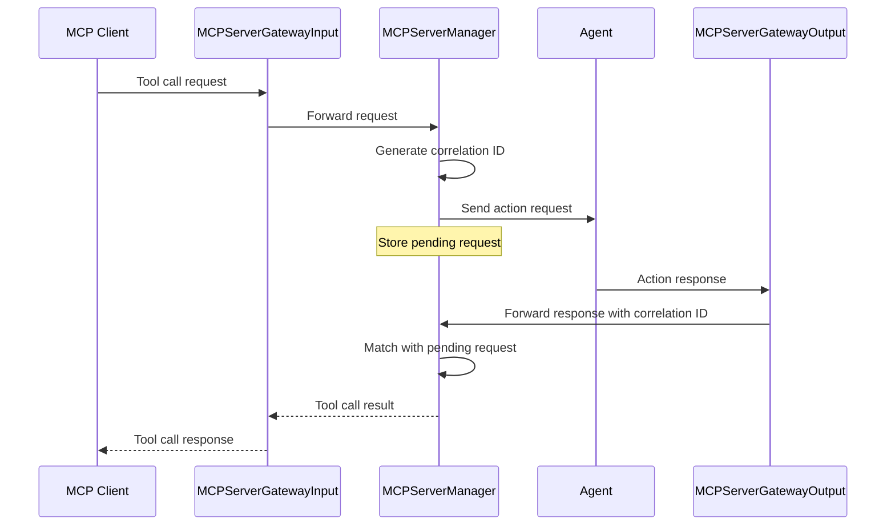
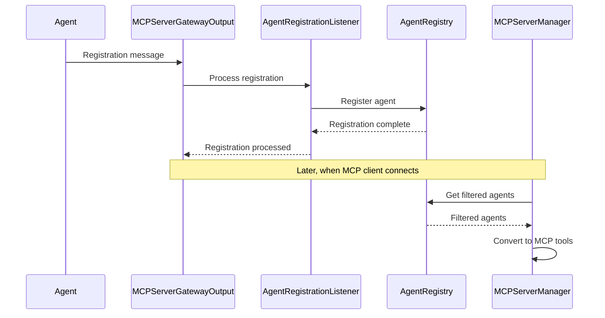

## Building an MCP Server Gateway for Agent Mesh

We are planning out how to build a Gateway for Agent Mesh that will act as an MCP server to MCP clients. 

This gateway is going to be very different from normal gateways in the Agent Mesh. Normally, the gateway will
simply forward incoming requests to the Orchestrator, and the orchestrator will decide which agents to call and how
to call them. 

Instead, this gateway is going to call the agents directly. It will also listen to the Agent register messages itself so that
it can build a registry of agents that it can call and provide that information to the MCP clients as tools that they can use.
When the MCP client wants to call an agent, it will call the gateway, and the gateway will call the agent. The response from the agent
will be transformed into an MCP response and sent back to the MCP client.

The gateway can be configured with a list of scopes that will control which actions are provided to the MCP clients. The scopes
will be used to filter the agents that are available to the MCP clients. 

In addition to listening to the agent register messages, the gateway will have to listen to agent response messages that would be destined for
the orchestrator so that it can transform them into MCP responses.

### Architecture

The MCP Server Gateway architecture consists of the following components:

1. **MCP Server Gateway Component**
   - Implements the MCP server interface to communicate with MCP clients
   - Manages client connections and sessions
   - Translates MCP requests into Agent Mesh actions
   - Transforms Agent Mesh responses back to MCP responses

2. **Agent Registry**
   - Listens to agent registration messages on the event mesh
   - Maintains a catalog of available agents and their capabilities
   - Filters agents based on configured scopes
   - Exposes agent actions as MCP tools

3. **Direct Agent Invocation**
   - Bypasses the Orchestrator for efficiency
   - Sends action requests directly to appropriate agents
   - Listens for action responses from agents
   - Handles timeouts and error conditions

4. **Response Transformation**
   - Converts agent action responses to MCP-compatible format
   - Handles different response types (text, files, etc.)
   - Manages streaming responses when needed

5. **Security & Scoping**
   - Enforces scope-based access control
   - Validates client permissions
   - Ensures only authorized actions are exposed

#### Data Flow

1. **Client Connection**:
   - MCP client connects to the gateway
   - Gateway authenticates the client and establishes session

2. **Tool Discovery**:
   - Client requests available tools
   - Gateway filters registered agents based on scopes
   - Gateway returns available agent actions as MCP tools

3. **Tool Invocation**:
   - Client sends tool request
   - Gateway translates to agent action request
   - Gateway sends request directly to agent
   - Agent processes request and returns response
   - Gateway transforms response to MCP format
   - Gateway sends response back to client

4. **Resource Handling**:
   - For file/resource responses, gateway stores in file service
   - Gateway provides appropriate references in MCP response

#### Implementation Components

The implementation will require:

1. **Gateway Interface Components**:
   - `MCPServerGatewayComponent`: Main gateway component
   - `MCPServerGatewayInput`: Handles incoming MCP requests
   - `MCPServerGatewayOutput`: Formats responses for MCP clients

2. **Agent Registry Components**:
   - `AgentRegistryListener`: Subscribes to agent registration topics
   - `AgentCatalog`: Maintains registry of available agents and actions

3. **Action Invocation Components**:
   - `DirectAgentInvoker`: Sends requests to agents
   - `ResponseListener`: Listens for agent responses

4. **Utility Components**:
   - `MCPTransformer`: Converts between MCP and Agent Mesh formats
   - `ScopeValidator`: Enforces scope-based access control

This architecture provides a direct bridge between MCP clients and Agent Mesh agents, bypassing the orchestrator for efficiency while maintaining security through scope-based access control.

### Topics and Queues

#### Subscription Topics

The MCP Server Gateway will need to subscribe to the following topics:

1. **Agent Registration Topics**
   - `solace-agent-mesh/v1/register/agent/*`
     - Used to listen for agent registration messages
     - Provides information about available agents and their capabilities
     - Updates the gateway's agent registry when new agents register or update their capabilities

2. **Action Response Topics**
   - `solace-agent-mesh/v1/actionResponse/agent/*/*`
     - Used to listen for responses from agents after action execution
     - Captures all agent responses regardless of which agent they come from
     - Allows the gateway to intercept responses meant for the orchestrator

3. **Action Response Timeout Topics**
   - `solace-agent-mesh/v1/actionResponse/agent/*/*/timeout`
     - Used to listen for timeout notifications when an agent fails to respond
     - Enables proper error handling for MCP clients

#### Publishing Topics

The MCP Server Gateway will publish messages to the following topics:

1. **Action Request Topics**
   - `solace-agent-mesh/v1/actionRequest/gateway/agent/{agent_name}/{action_name}`
     - Used to send action requests directly to agents
     - Bypasses the orchestrator for efficiency
     - Includes a correlation ID to match responses with requests

2. **Gateway Status Topics**
   - `solace-agent-mesh/v1/status/gateway/mcp-server`
     - Used to publish gateway status updates
     - Indicates whether the gateway is running and healthy
     - Includes information about connected MCP clients

#### Queues

The MCP Server Gateway will use the following queues:

1. **Request Processing Queue**
   - Stores incoming MCP client requests
   - Ensures requests are processed in order
   - Prevents request loss during high load
   - Managed with a configurable maximum depth and timeout

2. **Response Correlation Queue**
   - Maps request IDs to pending responses
   - Stores information about which MCP client is waiting for which response
   - Enables asynchronous processing of responses
   - Includes timeout mechanism to prevent memory leaks from abandoned requests

3. **Agent Registry Queue**
   - Stores updates to the agent registry
   - Ensures thread-safe updates to the registry
   - Processes registration messages in order
   - Periodically cleans up expired agent registrations

#### Queue Management

The queues will be managed as follows:

1. **Depth Limits**
   - Each queue will have a configurable maximum depth
   - When a queue reaches its depth limit, new messages will be rejected with appropriate error handling

2. **Timeouts**
   - Each queue entry will have a configurable timeout
   - Expired entries will be removed and appropriate error responses generated

3. **Persistence**
   - Queues will be in-memory by default for performance
   - Optional persistence can be enabled for reliability in production environments

4. **Monitoring**
   - Queue depths and processing times will be monitored
   - Alerts will be generated if queues exceed threshold values
   - Performance metrics will be collected for optimization

### Software Architecture

This section describes all the files that make up the MCP Server Gateway and their purposes within the overall architecture.

#### Core Components

1. **MCP Server Implementation**
   - `mcp_server.py`: Implements the core MCP server functionality, handling client connections, tool/resource/prompt registration, and request processing. It supports both stdio and SSE transports.
   - `mcp_server_factory.py`: Factory pattern implementation that manages MCP server instances, ensuring only one server exists per configuration.

2. **Gateway Components**
   - `mcp_server_gateway_input.py`: Handles incoming requests from MCP clients, adds MCP-specific properties, and forwards them to the appropriate handlers.
   - `mcp_server_gateway_output.py`: Processes agent responses, transforms them to MCP format, and routes them back to the appropriate MCP clients.

3. **Agent Management**
   - `agent_registry.py`: Maintains a catalog of available agents and their capabilities, with filtering by scopes.
   - `agent_registration_listener.py`: Listens for agent registration messages and updates the registry accordingly.

4. **Request Handling**
   - `mcp_server_manager.py`: Manages MCP server operations, including server initialization, tool registration, and request handling.
   - `session_manager.py`: Handles client sessions, authentication, and authorization.

5. **Agent Integration**
   - `mcp_server_agent_component.py`: Agent component that exposes MCP servers as solace-agent-mesh agents.
   - `actions/mcp_server_action.py`: Action implementation for invoking MCP server operations.
   - `async_server.py`: Handles asynchronous MCP server communication in a dedicated thread.

#### Component Interactions

Here are key interaction flows within the MCP Server Gateway:

##### 1. Client Connection and Tool Discovery

##### 2. Tool Execution Flow

##### 3. Agent Registration Flow

#### Configuration

The MCP Server Gateway is configured through several mechanisms:

1. **Environment Variables**
   - `GATEWAY_ID`: Identifier for the gateway (default: "mcp-server")
   - `SYSTEM_PURPOSE`: System purpose for the gateway (default: "You are a helpful assistant that can use tools to accomplish tasks.")
   - `MCP_SERVER_SCOPES`: Scopes to filter agents by (default: "*:*:*")
   - `MCP_SERVER_PORT`: Port for the MCP server (default: 8080)
   - `MCP_SERVER_HOST`: Host for the MCP server (default: "0.0.0.0")
   - `MCP_SERVER_TRANSPORT`: Transport type ("stdio" or "sse", default: "sse")

2. **Interface Configuration Files**
   - `interface-default-config.yaml`: Default configuration values
   - `interface-flows.yaml`: Flow definitions for the gateway

3. **Component Configuration**
   - Each component can be configured with specific parameters:
     - `mcp_server_scopes`: Scopes to filter agents by
     - `agent_ttl_ms`: Time-to-live for agent registrations in milliseconds
     - `agent_cleanup_interval_ms`: Interval for cleaning up expired agents

#### Potential Pitfalls and Considerations

1. **Transport Configuration**
   - **Issue**: Mismatched transport types between client and server
   - **Solution**: Ensure the `MCP_SERVER_TRANSPORT` setting matches the client's expected transport

2. **Scope Management**
   - **Issue**: Overly restrictive scopes preventing access to needed agents
   - **Solution**: Start with wildcard scopes (*:*:*) and restrict gradually
   - **Issue**: Overly permissive scopes exposing sensitive operations
   - **Solution**: Use specific scopes for production environments

3. **Correlation ID Handling**
   - **Issue**: Lost correlation IDs causing orphaned requests
   - **Solution**: Implement proper timeout handling and cleanup
   - **Issue**: Duplicate correlation IDs causing response confusion
   - **Solution**: Use UUIDs and verify uniqueness

4. **Resource Management**
   - **Issue**: Memory leaks from uncleaned pending requests
   - **Solution**: Regular cleanup of timed-out requests
   - **Issue**: Thread safety issues with shared resources
   - **Solution**: Proper use of locks for thread-safe operations

5. **Error Handling**
   - **Issue**: Unhandled exceptions causing gateway crashes
   - **Solution**: Comprehensive try-except blocks and error logging
   - **Issue**: Error responses not properly formatted for MCP clients
   - **Solution**: Consistent error transformation in `_transform_response_to_mcp_format`

6. **Performance Considerations**
   - **Issue**: Slow response times with many agents or complex tools
   - **Solution**: Implement request batching and response caching
   - **Issue**: High memory usage with many concurrent clients
   - **Solution**: Configure appropriate queue depths and timeouts

7. **Security Considerations**
   - **Issue**: Unauthorized access to sensitive operations
   - **Solution**: Proper session authentication and scope-based authorization
   - **Issue**: Exposure of internal system details in error messages
   - **Solution**: Sanitize error messages before sending to clients

By being aware of these potential issues and following the recommended solutions, you can ensure a robust and secure MCP Server Gateway implementation.

### Implementation Plan

#### Phase 1: Foundation and Agent Registry

1. **Task 1.1: Create Gateway Interface Structure** [DONE]
   - Create basic gateway interface files and directory structure [DONE]
   - Implement minimal configuration handling [DONE]
   - Set up logging and error handling [DONE]
   - Test: Verify gateway loads without errors [DONE]

2. **Task 1.2: Implement Agent Registry** [DONE]
   - Create `AgentRegistry` class to store agent information [DONE]
   - Implement methods to add, update, and remove agents [DONE]
   - Add filtering by scopes [DONE]
   - Test: Verify registry can store and retrieve agent information [DONE]

3. **Task 1.3: Agent Registration Listener** [DONE]
   - Subscribe to agent registration topics [DONE]
   - Process registration messages and update registry [DONE]
   - Handle agent expiration and cleanup [DONE]
   - Test: Verify registration messages are processed correctly [DONE]

#### Phase 2: MCP Server Implementation

4. **Task 2.1: Basic MCP Server Setup** [DONE]
   - Implement MCP server initialization [DONE]
   - Set up transport handling (stdio/SSE) [DONE]
   - Implement basic request/response handling [DONE]
   - Test: Verify server starts and responds to basic requests [DONE]

5. **Task 2.2: Tool Exposure** [DONE]
   - Convert agent actions to MCP tools [DONE]
   - Implement tool listing and discovery [DONE]
   - Add parameter validation [DONE]
   - Test: Verify tools are correctly exposed to MCP clients [DONE]

6. **Task 2.3: Resource Handling** [DONE]
   - Implement resource listing and retrieval [DONE]
   - Add agent resource integration [DONE]
   - Handle text resources [DONE]
   - Test: Verify resources can be listed and retrieved [DONE]

7. **Task 2.4: Prompt Support** [DONE]
   - Implement prompt template handling [DONE]
   - Add prompt listing and retrieval [DONE]
   - Support parameter substitution [DONE]
   - Test: Verify prompts are correctly exposed and usable [DONE]

#### Phase 3: Direct Agent Invocation

8. **Task 3.1: Action Request Sender** [DONE]
   - Implement direct agent action invocation [DONE]
   - Create correlation ID tracking [DONE]
   - Add request timeout handling [DONE]
   - Test: Verify requests are sent to correct agents [DONE]

9. **Task 3.2: Response Listener** [DONE]
   - Subscribe to action response topics [DONE]
   - Implement response correlation and routing [DONE]
   - Handle timeout notifications [DONE]
   - Test: Verify responses are correctly matched to requests [DONE]

10. **Task 3.3: Response Transformation** [DONE]
    - Convert agent responses to MCP format [DONE]
    - Handle different response types (text, files) [DONE]
    - Implement error handling and status codes [DONE]
    - Test: Verify responses are correctly transformed [DONE]

#### Phase 4: Advanced Features and Optimization

11. **Task 4.1: Remove Sampling Support** [DONE]
    - Remove sampling capability from implementation plan [DONE]
    - Note: In Solace Agent Mesh context, agents don't require sampling [DONE]
    - MCP servers wrapped by SAM agents handle their own LLM requests [DONE]
    - Agents don't have the ability to request sampling [DONE]

12. **Task 4.2: Session Management** [DONE]
    - Implement client session tracking [DONE]
    - Add authentication and authorization [DONE]
    - Support multiple concurrent clients [DONE]
    - Test: Verify multiple clients can connect simultaneously [DONE]

// 13. **Task 4.3: Performance Optimization** [SKIP THIS]
//     - Implement request batching
//     - Add response caching
//     - Optimize message serialization/deserialization
//     - Test: Verify performance improvements

// 14. **Task 4.4: Monitoring and Diagnostics** [SKIP THIS]
//     - Add metrics collection
//     - Implement health checks
//     - Create diagnostic endpoints
//     - Test: Verify monitoring provides useful information

#### Phase 5: Integration and Documentation

15. **Task 5.1: Integration Testing** [DONE]
    - Test with multiple agent types [DONE]
    - Verify interoperability with different MCP clients [DONE]
    - Test error handling and recovery [DONE]
    - Test: Verify end-to-end functionality [DONE]

16. **Task 5.2: Documentation** [DONE]
    - Create user documentation [DONE]
    - Add configuration examples [DONE]
    - Document API and interfaces [DONE]
    - Test: Verify documentation accuracy [DONE]

17. **Task 5.3: Deployment and Packaging**
    - Finalize packaging
    - Create deployment scripts
    - Add configuration templates
    - Test: Verify deployment in different environments

This implementation plan breaks down the development into logical phases with specific, testable tasks. Each task builds on previous work and can be tested independently to ensure the gateway is built correctly and functions as expected.
